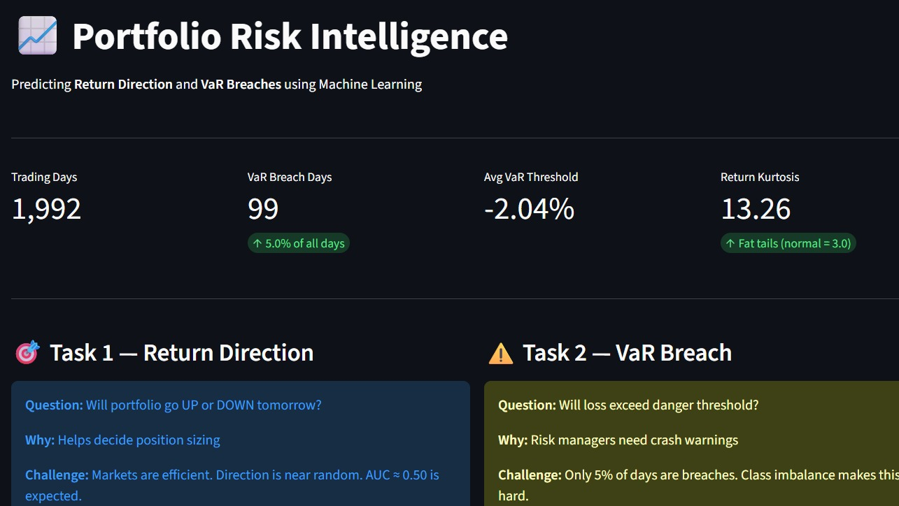
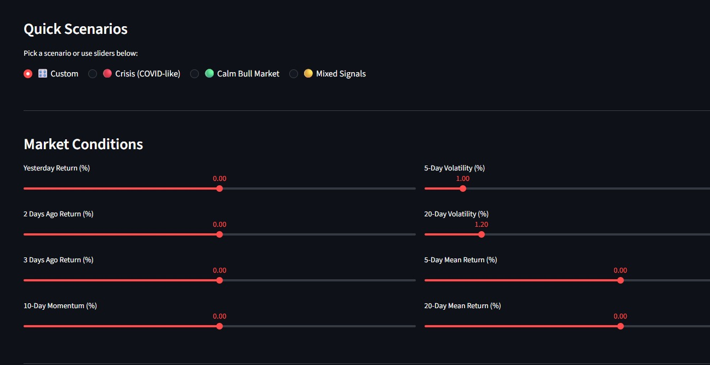
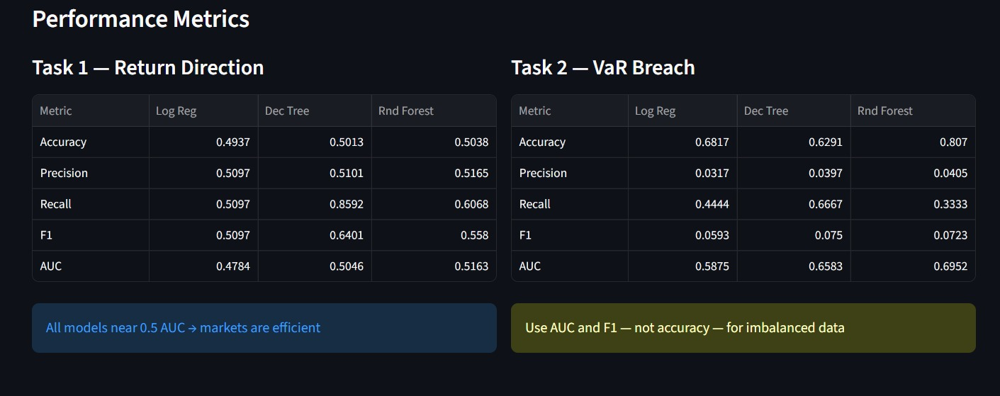
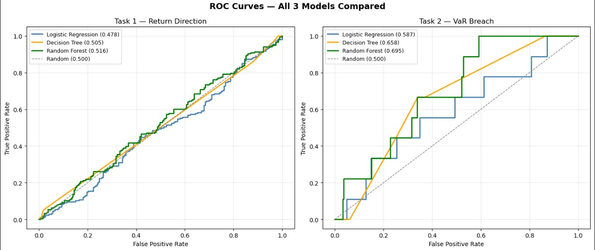

# 📊 Portfolio Risk Intelligence

> Predicting portfolio return direction and Value-at-Risk breaches using Machine Learning — built on real equity data from 2015 to 2023.


🔗 **[Live Demo → View the App](https://portfolio-risk-intelligence-tqm3xpsckulyuhuxscogq4.streamlit.app/)**

<p align="center">
  
</p>

---

## 🧠 Project Overview

This project applies supervised machine learning to two core problems in quantitative finance:

1. **Direction Prediction** — Can we predict whether a portfolio's daily return will be positive or negative?
2. **VaR Breach Detection** — Can we predict when portfolio losses will exceed the Value-at-Risk threshold?

The portfolio consists of four large-cap U.S. equities: **AAPL, MSFT, JPM, and XOM**, covering the period **January 2015 – December 2023**.

<p align="center">
  
</p>

---

## 🗂️ Project Structure

```
portfolio-risk-intelligence/
├── portfolio_model/
│   ├── data/
│   │   ├── features.csv           # Engineered feature matrix
│   │   ├── returns.csv            # Daily portfolio returns
│   │   ├── var.csv                # VaR threshold values
│   │   ├── y_return.csv           # Labels — return direction (Task 1)
│   │   └── y_var.csv              # Labels — VaR breach (Task 2)
│   ├── models/
│   │   ├── lr_return.pkl          # Logistic Regression — direction
│   │   ├── lr_var.pkl             # Logistic Regression — VaR breach
│   │   ├── dt_return.pkl          # Decision Tree — direction
│   │   ├── dt_var.pkl             # Decision Tree — VaR breach
│   │   ├── rf_return.pkl          # Random Forest — direction
│   │   ├── rf_var.pkl             # Random Forest — VaR breach
│   │   └── scaler.pkl             # Feature scaler
│   └── results.json               # Model evaluation metrics
├── notebooks/
│   └── Portfolio_clean.ipynb
├── app.py                         # Streamlit dashboard
├── .gitignore
└── README.md
```

---

## 📈 Tasks

### Task 1 — Return Direction Classification
**Label:** `1` if next-day portfolio return > 0, else `0`

Predicts whether the equally-weighted portfolio of AAPL, MSFT, JPM, and XOM will go **UP or DOWN** the next trading day.

### Task 2 — VaR Breach Detection
**Label:** `1` if portfolio loss exceeds the 95% historical VaR threshold

Predicts whether tomorrow's loss will be a **tail event** — particularly useful for risk management and capital allocation decisions.

---

## ⚙️ Algorithms

| Model | Strengths | Use Case Here |
|---|---|---|
| Logistic Regression | Interpretable, fast baseline | Establishes linear separability |
| Decision Tree | Captures non-linearities | Reveals key decision boundaries |
| Random Forest | Robust, handles noise | Best overall performance |

---

## 🔑 Key Findings

| Finding | Insight |
|---|---|
| **Risk is more predictable than returns** | VaR breach models outperform direction models — tail events have stronger structure |
| **50% AUC for direction ≈ efficient market** | Return direction is close to random; consistent with the Efficient Market Hypothesis |
| **Volatility clustering is the strongest signal** | Features derived from rolling volatility dominate feature importance in breach prediction |

> **Takeaway:** While predicting market *direction* is nearly impossible, predicting *when risk spikes* is a tractable ML problem — with real-world utility for portfolio hedging.

<p align="center">
  
</p>

<p align="center">
  
</p>

---

## 🚀 How to Run

### 1. Clone the repository
```bash
git clone https://github.com/sainaparwn/portfolio-risk-intelligence.git
cd portfolio-risk-intelligence
```

### 2. Install dependencies
```bash
pip install -r requirements.txt
```

### 3. Run the Jupyter Notebook
```bash
jupyter notebook notebooks/Portfolio_Risk_Intelligence.ipynb
```

### 4. Launch the Streamlit Dashboard
```bash
streamlit run app.py
```

---

## 📦 Dependencies

```
pandas
numpy
scikit-learn
matplotlib
seaborn
streamlit
yfinance
joblib
jupyter
```

---

## 📊 Data

- **Source:** Yahoo Finance via `yfinance`
- **Tickers:** AAPL, MSFT, JPM, XOM
- **Period:** January 2015 – December 2023
- **Frequency:** Daily OHLCV
- **Portfolio:** Equally weighted (25% each)

Raw CSVs and pre-trained `.pkl` model files are included in the repository for full reproducibility — no need to re-download data or retrain models.

---

## 🤝 Contributing

Pull requests are welcome. For major changes, please open an issue first to discuss what you'd like to change.

---

## 📄 License

[MIT](LICENSE)

---

*Built with Python · Scikit-Learn · Streamlit*
